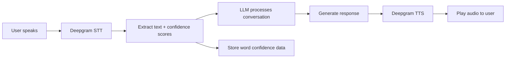

# Convlytics-LLM 🎙️

**AI-Powered Interview & Pronunciation Coach**

Convlytics-LLM is an advanced conversational AI application that helps users master their interview skills through real-time voice interaction. Powered by Large Language Models (LLMs) and professional speech-to-text/text-to-speech services, it provides comprehensive feedback on pronunciation, fluency, and communication effectiveness.


---

## ✨ Features

### 🎯 **Real-Time Voice Interaction**
- Engage in natural voice conversations with an AI interviewer
- Seamless speech-to-text and text-to-speech integration
- Professional-grade audio processing with Deepgram

### 📊 **Pronunciation Analysis**
- Word-level confidence scoring
- Identification of words needing improvement
- Categorization into "Needs Work", "Almost There", and "Excellent"

### 🤖 **AI-Powered Feedback**
- Grammar analysis and correction suggestions
- Personalized performance feedback
- Interview-style conversation guidance
- LLM-generated improvement recommendations

### 📈 **Comprehensive Analytics**
- Visual dashboards with pronunciation metrics
- Full conversation transcription
- Progress tracking across sessions
- Interactive charts and statistics

### 🎨 **Modern UI/UX**
- Beautiful glassmorphic design
- Responsive layout for all devices
- Smooth animations and transitions
- Dark mode optimized interface

---

## 🛠️ Tech Stack

### **Backend**
| Technology | Version | Purpose |
|-----------|---------|---------|
| Java | 21 | Core language |
| Spring Boot | 3.5.9 | Application framework |
| Spring AI | 1.1.2 | LLM integration |
| Maven | - | Dependency management |

### **AI & Models**
| Service | Purpose |
|---------|---------|
| **OpenAI API** | LLM conversations (Nemotron 3 Nano) |
| **Deepgram** | Speech-to-Text (Nova-3 model) |
| **Deepgram** | Text-to-Speech (Aura models) |

### **Frontend**
| Technology | Purpose |
|-----------|---------|
| HTML5 | Structure |
| JavaScript (ES6+) | Interactivity |
| Tailwind CSS | Styling |
| Font Awesome | Icons |

### **Additional Libraries**
- **Flexmark** - Markdown parsing and rendering
- **Jackson** - JSON processing
- **WebClient** - Reactive HTTP client

---

## 🚀 Getting Started

### Prerequisites

Before running Convlytics-LLM, ensure you have:

- **Java 21** or higher installed
- **Maven 3.6+** for building the project
- **OpenAI-compatible API** access (e.g., OpenRouter, OpenAI)
- **Deepgram API** key for speech services

### Installation

1. **Clone the repository**
   ```bash
   git clone https://github.com/gaurabhkr/Convlytics-LLM.git
   cd Convlytics-LLM
   ```

2. **Configure API Keys**
   
   Open `src/main/resources/application.properties` and update with your credentials:
   
   ```properties
   # OpenAI-compatible API Configuration
   spring.ai.openai.api-key=YOUR_OPENAI_API_KEY
   spring.ai.openai.base-url=YOUR_BASE_URL
   
   # Deepgram Configuration
   deepgram.api-key=YOUR_DEEPGRAM_API_KEY
   deepgram.base-url=https://api.deepgram.com/v1/speak
   ```

   > **Note**: The application uses OpenRouter by default. Replace `BASE_URL` with your OpenAI-compatible endpoint.

3. **Build the project**
   ```bash
   mvn clean install
   ```

4. **Run the application**
   ```bash
   mvn spring-boot:run
   ```

5. **Access the application**
   
   Open your browser and navigate to:
   ```
   http://localhost:8080
   ```

---

## ⚙️ Configuration

### LLM Model Configuration

The default LLM model is **Nvidia Nemotron 3 Nano** (30B parameters), which is configured in:
- `ConvolyticsLLMConfiguration.java` (line 38)

To change the model:
```java
var options = OpenAiChatOptions.builder()
    .model("your-model-name")  // Change this
    .build();
```

### Speech Model Configuration

**Text-to-Speech Models** (Deepgram Aura):
- `aura-2-hyperion-en`, `aura-2-zeus-en`, `aura-2-pluto-en`
- `aura-2-orpheus-en`, `aura-helios-en`
- Default: `aura-angus-en` (configured in `DeepgramTTS.java`)

**Speech-to-Text**:
- Model: `nova-3`
- Language: `en-IN` (English - India)

---

## 📖 Usage

### Starting an Interview Session

1. **Navigate to the AI Interview page**
   - Click "AI Interview" in the navigation bar

2. **Start a new meeting**
   - Click the "New Meeting" button
   - Grant microphone permissions when prompted

3. **Interact with the AI**
   - Click the microphone button to start recording
   - Speak your answer or question
   - Click again to stop recording
   - The AI will process and respond with voice

4. **End the session**
   - Click "End Meeting" when finished

### Viewing Analytics

1. **Access the Analysis page**
   - Click "Analysis" in the navigation bar

2. **Review your performance**
   - **Overall Score**: Your pronunciation accuracy percentage
   - **Word Categories**: See which words need improvement
   - **Transcription**: Full text of your conversation
   - **AI Feedback**: Personalized grammar and performance tips

---

## 📁 Project Structure

```
Convlytics-LLM/
├── src/
│   └── main/
│       ├── java/com/convlytics/Convlytics_LLM/
│       │   ├── Configuration/
│       │   │   └── ConvolyticsLLMConfiguration.java    # Spring AI & LLM setup
│       │   ├── Controller/
│       │   │   └── ConvolyticsLLMController.java       # REST API endpoints
│       │   ├── Services/
│       │   │   ├── DeepgramSTT.java                    # Speech-to-Text service
│       │   │   └── DeepgramTTS.java                    # Text-to-Speech service
│       │   └── ConvlyticsLlmApplication.java           # Main application
│       └── resources/
│           ├── application.properties                   # Configuration
│           └── static/
│               ├── index.html                          # Landing page
│               ├── Conversations.html                   # AI Interview interface
│               └── Analysis.html                        # Analytics dashboard
├── pom.xml                                             # Maven dependencies
└── README.md
```

---

## 🔌 API Endpoints

### Conversation Endpoints

| Method | Endpoint | Description |
|--------|----------|-------------|
| `GET` | `/api/llm/{message}` | Send a text message to the LLM |
| `POST` | `/api/speech-to-text` | Convert audio to text |
| `POST` | `/api/text-to-speech` | Convert text to audio |
| `POST` | `/api/llm-conversation` | Complete voice conversation flow |

### Analysis Endpoints

| Method | Endpoint | Description |
|--------|----------|-------------|
| `GET` | `/api/word-score` | Get overall pronunciation score |
| `GET` | `/api/low-words` | Get words with low confidence |
| `GET` | `/api/mid-words` | Get words with medium confidence |
| `GET` | `/api/total-word` | Get total word count |
| `GET` | `/api/conversation-transcription` | Get full transcription |
| `GET` | `/api/llm-final-trascription` | Get AI feedback on performance |

### Session Management

| Method | Endpoint | Description |
|--------|----------|-------------|
| `GET` | `/api/files/clear` | Clear session data and reset |

---

## 🎨 UI Components

### Pages

1. **Home (`index.html`)**
   - Landing page with feature overview
   - How-it-works section
   - Call-to-action buttons

2. **AI Interview (`Conversations.html`)**
   - Interactive AI sphere visualization
   - Recording controls
   - Real-time status indicators

3. **Analysis (`Analysis.html`)**
   - Pronunciation score gauge
   - Word distribution donut chart
   - Categorized word lists
   - Full transcription view
   - AI-generated feedback

---

## 🧠 How It Works

### Conversation Flow



### Pronunciation Analysis

1. **Real-time Scoring**: Each spoken word receives a confidence score (0.0 - 1.0)
2. **Categorization**:
   - **Low (< 0.6)**: Needs significant improvement
   - **Medium (0.6 - 0.8)**: Almost there, minor improvements needed
   - **High (> 0.8)**: Excellent pronunciation
3. **Overall Score**: Calculated as percentage of well-pronounced words

---

## 🤝 Contributing

Contributions are welcome! Please feel free to submit a Pull Request.

1. Fork the repository
2. Create your feature branch (`git checkout -b feature/AmazingFeature`)
3. Commit your changes (`git commit -m 'Add some AmazingFeature'`)
4. Push to the branch (`git push origin feature/AmazingFeature`)
5. Open a Pull Request

---

## 📝 License

This project is licensed under the MIT License - see the [LICENSE](LICENSE) file for details.

---

## 🙏 Acknowledgments

- **OpenAI** for LLM technology
- **Deepgram** for speech services
- **Spring AI** for LLM integration framework
- **Tailwind CSS** for beautiful UI components

---

## 📧 Contact

For questions or support, please open an issue in the GitHub repository.

**Author**: [Gaurabh Kumar](https://github.com/gaurabhkr)

---

<div align="center">
  <strong>Built with ❤️ using Spring Boot & Spring AI</strong>
</div>
